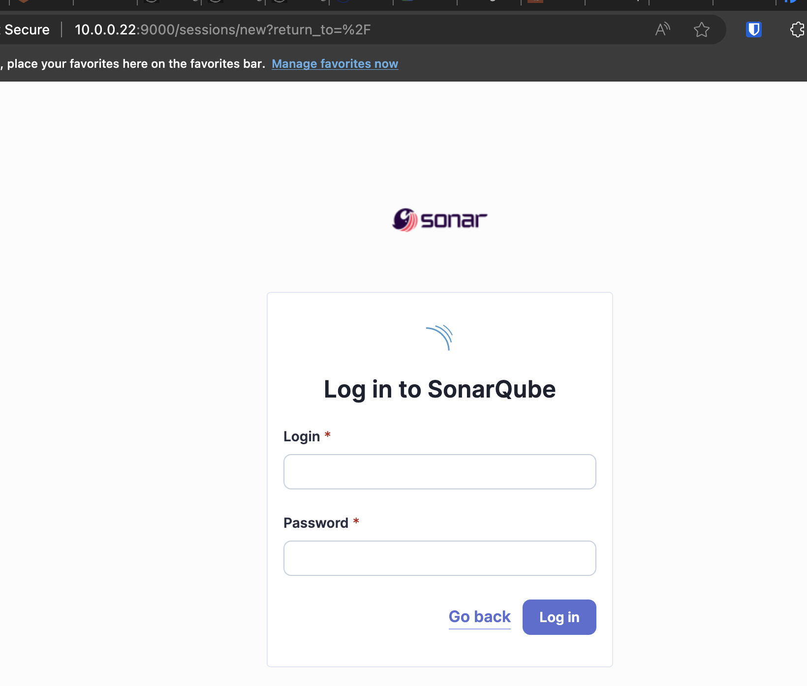

# Installing and Configuring Sonarqube

- switch into postgres user
```
sudo -i -u postgres
```

- create user and database
```
createuser sonar
createdb sonar
```

- set password for sonar and grant privileges
```
psql
ALTER USER sonar WITH ENCRYPTED PASSWORD 'your_password';
GRANT ALL PRIVILEGES ON DATABASE sonar TO sonar;

\c sonar
GRANT ALL ON SCHEMA public TO sonar;
GRANT ALL PRIVILEGES ON ALL TABLES IN SCHEMA public TO sonar;
GRANT ALL PRIVILEGES ON ALL SEQUENCES IN SCHEMA public TO sonar;
GRANT ALL PRIVILEGES ON ALL FUNCTIONS IN SCHEMA public TO sonar;
GRANT USAGE ON SCHEMA public TO sonar;
GRANT CREATE ON SCHEMA public TO sonar;
```

- exit database and go back to original user
```
exit 
exit
```

- update pg_hba.conf
```
sudo nano /etc/postgresql/16/main/pg_hba.conf

local   sonar           sonar                                   scram-sha-256 
```

- download sonarqube
```
cd /opt
sudo wget https://binaries.sonarsource.com/Distribution/sonarqube/sonarqube-10.6.0.92116.zip
```

- unzip file and change dir permissions
```
sudo apt install unzip -y
sudo unzip sonarqube-10.6.0.92116.zip
sudo mv sonarqube-10.6.0.92116 sonarqube

sudo adduser sonar
sudo chown -R sonar:sonar /opt/sonarqube
```

- update db props
```
sudo nano /opt/sonarqube/conf/sonar.properties

# PostgreSQL settings
sonar.jdbc.username=sonar
sonar.jdbc.password=your_password
sonar.jdbc.url=jdbc:postgresql://localhost/sonar
```

- setup service
```
sudo nano /etc/systemd/system/sonarqube.service
```

- copy the folloiwng into the file
```
[Unit]
Description=SonarQube service
After=syslog.target network.target

[Service]
Type=forking
User=sonar
Group=sonar

ExecStart=/opt/sonarqube/bin/linux-x86-64/sonar.sh start
ExecStop=/opt/sonarqube/bin/linux-x86-64/sonar.sh stop
ExecReload=/opt/sonarqube/bin/linux-x86-64/sonar.sh restart

Restart=on-failure

[Install]
WantedBy=multi-user.target
```

- reload and start/enable sonar
```
sudo systemctl daemon-reload
sudo systemctl start sonarqube
sudo systemctl enable sonarqube
```

- confirm service is up by opening webpage -> http://ip_addr:9000

