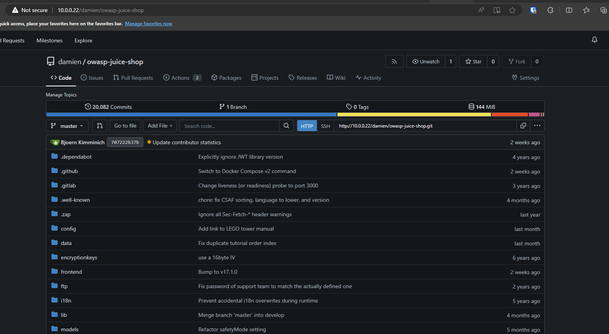

## Prerequisites

Before starting, ensure that you have the following:

- Access to a Gitea instance
- Jenkins set up with required plugins (e.g., Git, SonarQube, Docker, etc.)
- A SonarQube instance
- Docker installed on your machine

## Step 1: Clone the Codebase

On your local machine, clone the juice-shop-sonarscanning repository:

```bash
git clone https://github.com/The-DevSec-Blueprint/juice-shop-sonarscanning.git
```

## Step 2: Create a New Project in Gitea

1. Log into your Gitea instance and navigate to create a new repository.

    

2. Fill out the necessary information:
    - **Repository name**: `owasp-juice-shop`
    - **Visibility**: `public`
    - **Description**: *(Optional)*
    - **Default branch**: `master`

    

3. Click on the **Create Repository** button.

4. Confirm that the repository has been created successfully.

    

## Step 3: Point the Local Repository to Gitea

In your local `juice-shop-sonarscanning` directory, update the git origin to point to your new Gitea repository:

```bash
cd juice-shop-sonarscanning/
git remote remove origin
git remote add origin http://<your_gitea_server_ip>/damien/owasp-juice-shop.git
git push -u origin master
```

## Step 4: Authorize Your Application

After pushing your code, Gitea might prompt you to authorize your application.


## Step 5: Confirm the Changes

Ensure that your changes have been pushed to the Gitea repository.



## Step 6: Remove GitHub Workflows Directory

Remove the GitHub workflows directory from the repository:

```bash
rm -rf .github/workflows
git add .
git commit -m "removing workflows"
git push
```

## Step 7: Create Jenkinsfile for CI/CD Pipeline

Create a `Jenkinsfile` in the root directory of your repository with the following content:

```groovy
pipeline {
    agent any

    environment {
       SONAR_TOKEN = credentials('sonar-analysis')
       SONAR_PROJECT_KEY = 'owasp-juice-shop'
    }

    stages {
        stage('Clone') {
            steps {
                checkout scmGit(branches: [[name: '*/master']], extensions: [], userRemoteConfigs: [[credentialsId: 'Gitea PAT', url: 'http://<your_gitea_server_url>/damien/owasp-juice-shop.git']])
            }
        }
        stage('Build and Install') {
            parallel {
                stage('NPM Build') {
                    steps {
                        sh 'npm install'
                    }
                }
                stage('Docker Compile') {
                    steps {
                        sh 'docker build -t my-app:${BUILD_NUMBER} .'
                    }
                }
            }
        }
        stage('Security Scan'){
            parallel {
                stage('Sonar Scan') {
                    steps {
                        script {
                            try {
                                withSonarQubeEnv(installationName: 'Sonar Server', credentialsId: 'sonar-analysis') {
                                    sh '''
                                    docker run --rm \
                                    -e SONAR_HOST_URL="${SONAR_HOST_URL}" \
                                    -e SONAR_TOKEN="${SONAR_TOKEN}" \
                                    -v "$(pwd):/usr/src" \
                                    sonarsource/sonar-scanner-cli \
                                    -Dsonar.projectKey="${SONAR_PROJECT_KEY}" \
                                    -Dsonar.qualitygate.wait=true \
                                    -Dsonar.sources=.
                                    '''
                                }
                            } catch (Exception e) {
                                echo "Quality Gate check has failed: ${e}"
                                currentBuild.result = 'UNSTABLE'
                            }
                        }
                    }
                }
                stage('Security Scan') {
                    steps {
                        sh '''
                            trivy image --severity HIGH,CRITICAL my-app:${BUILD_NUMBER}
                        '''
                    }
                }
            }
        }
        stage('Push To Registry') {
            steps {
                sh '''
                    docker tag my-app:${BUILD_NUMBER} <your_server_ip>:5000/my-app:latest
                    docker push <your_server_ip>:5000/my-app:latest
                '''
            }
        }
        stage('Deploy') {
            agent { label 'dsb-node-01' }
            steps {
                script {
                        echo 'Deploying to DSB Node 01'
                        sh '''
                        docker pull <your_server_ip>:5000/my-app:latest
                        docker stop my-app || true
                        docker rm my-app || true
                        docker run -d --name my-app -p 8084:3000 <your_server_ip>:5000/my-app:latest
                        '''
                }
            }
        }
    }
    post {
        always {
            sh 'docker image prune -f'
            cleanWs()
        }
    }

}
```

This pipeline will:

- Clone the repository from Gitea.
- Build the project using NPM and Docker.
- Perform security scans using SonarQube and Trivy.
- Push the Docker image to a registry.
- Deploy the application to a server.

## Conclusion

By following these steps, you've successfully set up the OWASP Juice Shop project with Sonar Scanning on Gitea and Jenkins. Your CI/CD pipeline is now ready to ensure code quality and security throughout the development process.
