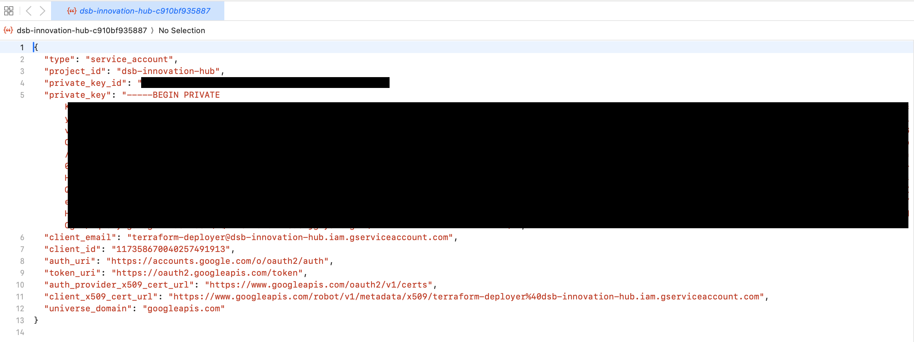

## Overview

This guide will help you set up a Service Account in Google Cloud Platform (GCP) that Terraform can use to deploy infrastructure changes. By this stage, you should already have a GCP project ready for deployment.

## Creating and Configuring a Service Account

1. Log in to your GCP account.
2. Navigate to the **IAM & Admin** section and select **Service Accounts** from the menu.
3. Click **Create Service Account** named `terraform-deployer`.
4. Enter a **Service Account Name** and optionally a description. Click **Create and Continue**.

   

5. Under **Grant this service account access to the project**, add the following roles:

   - Editor
   - Project IAM Admin
   - Role Administrator
   - Secret Manager Admin
   - Secret Manager Secret Accessor

6. Under **Grant users access to this service account**, leave it empty and click **Done**.

7. Once the service account is created, locate it in the list, click the **More Actions** menu (three dots), and select **Manage Keys**.
8. Click **Add Key**, then select **Create New Key**. Choose the **JSON** key type and click **Create**.
9. Save the downloaded key file in a secure location. This file contains the credentials needed for Terraform.

   

With these steps completed, your GCP Service Account is set up and ready to be used for Terraform deployments.
